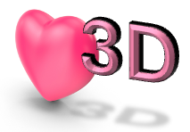

# LOV3D

**LOV3D** is a Matlab package for obtaining the tidal response of viscoelastic self-gravitating bodies with lateral variations of interior properties. For a given interior structure and tidal load, the software solves the mass conservation, momentum conservation and Poisson equations and computes the tidal Love numbers. This is done in the spectral domain as detailed in [Rovira-Navarro et al. 2023](https://arxiv.org/abs/2311.15710).

## Requirements

The code runs with MATLAB R2023a. 
Ghostscript is required if the user wants to store plots in pdf format.
The code uses the following third-party libraries: 

- [cmocean](https://github.com/chadagreene/cmocean): Thyng, Kristen, et al. “True Colors of Oceanography: Guidelines for Effective and Accurate Colormap Selection.” Oceanography, vol. 29, no. 3, The Oceanography Society, Sept. 2016, pp. 9–13, doi:10.5670/oceanog.2016.66.  
- [M_Map](www.eoas.ubc.ca/~rich/map.html): Pawlowicz, R., 2020. "M_Map: A mapping package for MATLAB", version 1.4m, [Computer software], available online at www.eoas.ubc.ca/~rich/map.html.  
- [export_fig](https://github.com/altmany/export_fig/releases/tag/v3.40): Yair Altman (2023). export_fig (https://github.com/altmany/export_fig/releases/tag/v3.40), GitHub. Retrieved November 21, 2023.  
- [harmonicY](https://www.mathworks.com/matlabcentral/fileexchange/74069-wigner-3j-6j-9j): Javier Montalt Tordera (2023). Spherical Harmonics, GitHub. Retrieved November 21, 2023. 
- [Wigner 3j-6j-9j](https://www.mathworks.com/matlabcentral/fileexchange/74069-wigner-3j-6j-9j): Vladimir Sovkov (2023). Wigner 3j-6j-9j, MATLAB Central File Exchange. Retrieved October 4, 2023.  

## Usage

See the manual in `./docs` for information on inputs and outputs of the code.

The `tests/` directory contains several examples

- [**One layer, spherically-symmetric**](./tests/Test_One_Layer_Spherically_Symmetric.mlx): Compares LOV3D Love numbers against love numbers obtained analytically for a uniform spherically-symmetric body
- [**Multi-layered Spherically-symmetric**](./tests/Test_Io_Multi_Layer_Spherically_Symmetric.mlx): Multi-layered Io model based on [Steinke et al. 2020](https://doi.org/10.1016/j.icarus.2019.05.001), consisting of core, deep mantle, asthenosphere and lithosphere. The script obtains the Love numbers and compares them against results obtained with the spherically-symmetric code of  [Rovira-Navarro et al. 2022](https://doi.org/10.1029/2021JE007117). 
- [**Multi-layered Spherically-symmetric_Tidal_Heating**](./tests/Test_Io_Multi_Layer_Spherically_Symmetric_Tidal_Heating.mlx): Same as the previous test but:
	- (1) tidal heating is computed using  [get_energy.m](./src/get_energy.m)
	- (2) the geographical distribution of tidal heating is shown using the [plot_energy_map.m](./src/Plot_Tools/plot_energy_map.m) plotting function. 
	- (3) the y functions are computed and plotted using [get_map.m](../src/get_map.m) and [plot_map.m](./src/Plot_Tools/plot_map.m) 
- [**Multi-layered spherically-symmetric icy moon**](./tests/Test_Europa_Titan_Spherically_Symmetric.mlx): Multi-layered icy moon model. The script computes the Love numbers for a multi-layered Europa and Titan models based on [Beuthe et al. 2013](https://www.sciencedirect.com/science/article/pii/S0019103512004745?casa_token=xg0XfpmaHT4AAAAA:Qau6ppdURvhX_Vgm_NiDZVwEtERNnqcosVviHYGaLIHJLBugG7ZgBEnHNPG921Qc5SZAktQ6kw). 
- [**Enceladus with lateral variations**](./tests/Test_Enceladus_Two_Layers_Lateral_Variations.mlx): 3 layer Enceladus model consisting of a rigid core, ocean and ice-shell with lateral variations. Compares LOV3D Love numbers against love numbers obtained using the perturbation method of [Qin et al.](https://doi.org/10.1093/gji/ggu279) and the FEM model of [Berne et al.](https://doi.org/10.1029/2023GL106656). Reproduces Figure 2 of [Rovira et al. 2024](https://doi.org/10.48550/arXiv.2311.15710)
- [**Europa with lateral variations**](./tests/Test_Europa_Lateral_Variations.mlx): Europa model with lateral variations. The script computes the Love number spectra and the y functions. The script also uses the [plot_y.m](./src/Plot_Tools/plot_y.m) to plot the "y" functions (U,V,W,R,S,T, phi). 
- [**Consistency check tidal heating**](Consistency_test_Energy.m): This script can computes tidal heating using the Love numbers or the direct integration of the product of stress and strain rate and compares the results.  

## Structure 

In this repository you can find the following directories: 

- ` data/` contains data used in the code, including the coupling coefficients 
- ` docs/` documentation, including a user manual 
- ` licenses/` licenses of current software and some external routines used in the code 
- ` scripts/` some scripts that use the code 
- ` src/` source code 
- `tests/ ` contains several tests an examples 

## Documentation 

The theory behind the method is detailed in [Rovira-Navarro et al. 2023](https://arxiv.org/abs/2311.15710). A user manual can be found in ` Docs/`

## Author (s)

This software have been developed by: 

- **Marc Rovira-Navarro** :   [0000-0002-9980-5065] Conceptualization, methodology and software  
- **Isamu Matsuyama**:  [0000-0002-2917-8633] Conceptualization   
- **Allard Veenstra** software   

## License

The contents in the `docs/` directory together with all `png` files present in this repository are licensed under a **CC-BY 4.0** (see [CC-BY-4.0](LICENSES/CC-BY-4.0.txt) file). 

The source code, data files and example scripts are licensed under an **Apache License v2.0** (see [Apache-License-v2.0](LICENSES/Apache-License-v2.0.txt) file).

The following copyright notice is applicable to employees of Technische Universiteit Delft only (**Marc Rovira-Navarro** and **Allard Veenstra**):  

Copyright notice:

Technische Universiteit Delft hereby disclaims all copyright interest in the program “LOV3D”. LOV3D is a  Matlab package for obtaining the tidal response of bodies with lateral variations of interior properties by the Author(s).  
Henri Werij, Dean of Faculty of Aerospace Engineering, Technische Universiteit Delft.

&copy; 2023, M. Rovira-Navarro, I. Matsuyama, A. Veenstra

The code uses the following third party libraries:

Licenses and copyright statements for [cmocean](https://github.com/chadagreene/cmocean), [export_fig](https://github.com/altmany/export_fig/releases/tag/v3.40), [harmonicY](https://www.mathworks.com/matlabcentral/fileexchange/74069-wigner-3j-6j-9j) and [Wigner 3j-6j-9j]((https://www.mathworks.com/matlabcentral/fileexchange/74069-wigner-3j-6j-9j))  can be found in the [LICENSES](LICENSES/) folder.

## References

This software have been used in the following publications

- [Rovira-Navarro, M., Matsuyama, I., Berne, A. 2023](https://arxiv.org/abs/2311.15710). A Spectral Method to Compute the Tides of Laterally-Heterogeneous Bodies. arXiv e-prints. doi:10.48550/arXiv.2311.15710
- Rovira-Navarro, M.,Matsuyama, I. & Berne, A., 2023 Revealing lateral structures in the interiors of planets and moons from tidal observations. AGU Fall Meeting Abstracts (2023).  
- [Rovira-Navarro, M. & Matsuyama, I. 2022](https://ui.adsabs.harvard.edu/abs/2022AGUFM.P45E2514R/abstract)., A Spectral Method to Study the Tides of Laterally Heterogenous Bodies.  AGU Fall Meeting Abstracts.  

## Cite this repository 

If you use this software please cite it as:

- (Rovira-Navarro, M., Matsuyama, I., Berne, A. 2023)[https://doi.org/10.3847/PSJ/ad381f]. A Spectral Method to Compute the Tides of Laterally-Heterogeneous Bodies. Planetary Science Journal, 5

## Would you like to contribute?

If you have any questions or queries or would like to contribute contact M. Rovira-Navarrro at m.roviranavarro@tudelft.nl

Future developments include: 
- Extend the code to other loadings (e.g., surface loads)
- Benchmark with FEM-viscoelastic code

Found a bug? Report and "Issue" in the issue's tab. 

